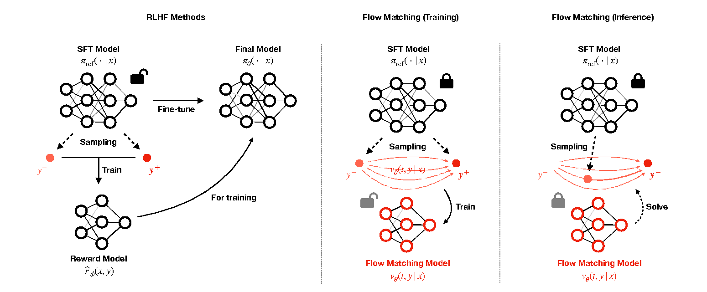

# Preference Alignment with Flow Matching

<a href="https://arxiv.org/abs/2405.19806"></a>
<a href=#bibtex></a>

  

### Description

Preference Flow Matching (PFM) is a new framework for aligning an arbitrary class of pre-trained models to (human) prefernces. Existing alignment methods require fine-tuning pre-trained models, which presents challenges such as scalability, inefficiency, and the need for model modifications, especially with black-box APIs like GPT-4. In contrast, PFM utilizes flow matching techniques to directly learn from preference data, thereby reducing the dependency on extensive fine-tuning of pre-trained models. By leveraging flow-based models, PFM transforms less preferred data into preferred outcomes, and effectively aligns model outputs with human preferences without relying on explicit or implicit reward function estimation, thus avoiding common issues like overfitting in reward models.

|                                          | RLHF    | DPO     | IPO       | CPL     | FTB     | Ours    |
|------------------------------------------|---------|---------|-----------|---------|---------|---------|
| Reward Model Free                        | ✘       | ✔       | ✔         | ✔       | ✔       | ✔       |
| No Preference Assumptions                | ✘       | ✘       | ✔         | ✘       | ✘       | ✔       |
| General Models and Tasks                 | ✔       | △       | △         | △       | △       | ✔       |
| Preserves Pre-trained Model              | ✘       | ✘       | ✘         | ✘       | ✔       | ✔       |
| Applicable to Black-Box Models           | ✘       | ✘       | ✘         | ✘       | ✔       | ✔       |


### Installation 
Download `PyTorch` of desired version according to the instructions in [the official PyTorch website](https://pytorch.org/). We recommend `PyTorch >= 2.2.2`.

Then, install relavant pacakges from `requirements.txt`.

### Quick Guide
Given a pretrained (reference) model (or policy) $\pi_{\mathrm{ref}}$, and a pre-collected preference data $\mathcal{D} = \{(x_{i}, y_{i}^{+}, y_{i}^{-})\}_{i=1}^{N}$, where each $x_{i}$ denotes the context (or prompt), and each $y_{i}^{+}, y_{i}^{-} \sim \pi_{\mathrm{ref}}(\cdot | x_{i})$ are sampled from the reference policy, we learn the "*preference flow*":from the marginal distribution of *less preferred data* $p_{0}(y^{-} | x)$ to the marginal distribution of *more preferred data* $p_{1}(y^{+} | x)$. All the codes required for collecting the preference data $\mathcal{D}$ are organized under `dataset` directory. The flow matching module (adapted from the `torchcfm` library) is provided under the directory `flow`.  

The PFM framework is very simple to implement. All of our code examples follow the below pipeline:
```python
from flow import OptimalTransportConditionalFlowMatching

reference_policy = ... # Any base (reference) model or your interest
preference_dataset = ... # Your preference dataset, yielding pairs (x, y^+, y^-).

# Flow matching model. 
# Input and output of this model should match the size of
# the output of the reference policy.
flow_model = ...

# For training PFM, simply call `fit` method.
flow_matching = OptimalTransportConditionalFlowMatching(flow_model)
flow_matching.fit(
  dataset,
  num_epochs=100,
  batch_size=64,
  learning_rate=1e-3,
  conditional=True # Set to `True` if contexts x are given.
)

# For evaluation, simply modify the generated output from the reference policy
# using the `compute_target` method.
context = ... # e.g. a prompt
generated_sample = reference_policy(context) # e.g. a response
improved_sample = flow_matching.compute_target(
  generated_sample,
  context=context
)
```

### Tutorials

To see full working examples, you can run `.ipynb` files. Since our method requires only tuning a small add-on module, all training can be done within few minutes.

For ***conditional image generation task*** with `MNIST` dataset, see `example_mnist.ipynb`. For ***controlled text generation task*** on the `IMDB` dataset, refer to the codes in `example_imdb.ipynb`. Finally, for ***PBRL task*** on a simple `gym[box2d]` environment, see `example_pbrl.ipynb`. Corresponding codes for preference data collection are organized at `mnist_dataset.py`, `imdb_dataset.py`, and `pbrl_dataset.py`, respectively. 

<div style="display: flex; justify-content: center; align-items: center;">
  
  
</div>

### Cite Our Work

If PFM is found useful in your own research, please cite the below paper.

```bibtex
@article{kim2024preference,
  title={Preference Alignment with Flow Matching},
  author={Kim, Minu and Lee, Yongsik and Kang, Sehyeok and Oh, Jihwan and Chong, Song and Yun, Seyoung},
  journal={arXiv preprint arXiv:2405.19806},
  year={2024}
}
```